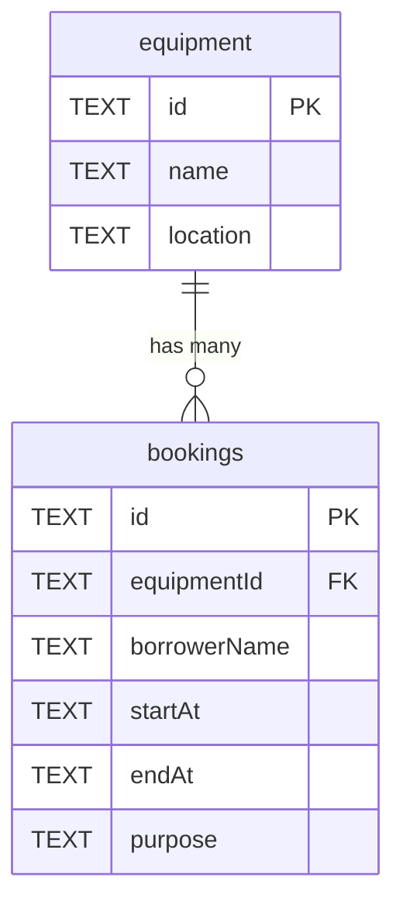

# SCHEMA_ERD.md

**Database:** Cloudflare D1 (SQLite). The full SQL is in `schema.sql`.

## ERD

One piece of equipment can have many bookings. Each booking belongs to exactly one piece of equipment.

## Tables

### equipment
| Column | Type | Constraints |
|---|---|---|
| id | TEXT | Primary key |
| name | TEXT | Not null |
| location | TEXT | Not null |

### bookings
| Column | Type | Constraints |
|---|---|---|
| id | TEXT | Primary key (UUID) |
| equipmentId | TEXT | Not null, foreign key to `equipment(id)` |
| borrowerName | TEXT | Not null |
| startAt | TEXT | Not null, ISO 8601 UTC |
| endAt | TEXT | Not null, ISO 8601 UTC |
| purpose | TEXT | Not null, default `''` |

**Index:** `idx_bookings_equipment_time` on `(equipmentId, startAt, endAt)` makes the overlap check faster.

## Design notes
- Times are stored as ISO 8601 UTC text, so comparing them as text gives the correct time order.
- The overlap check is done in the API code (`src/index.ts`) before saving, using parameter binding.
- Seed data: `eq-1` Projector A, `eq-2` Camera B, `eq-3` Meeting Room C.
